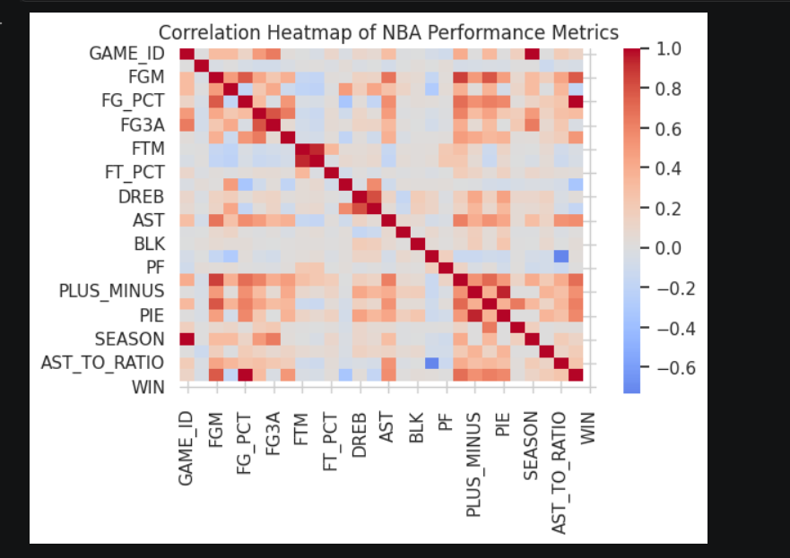
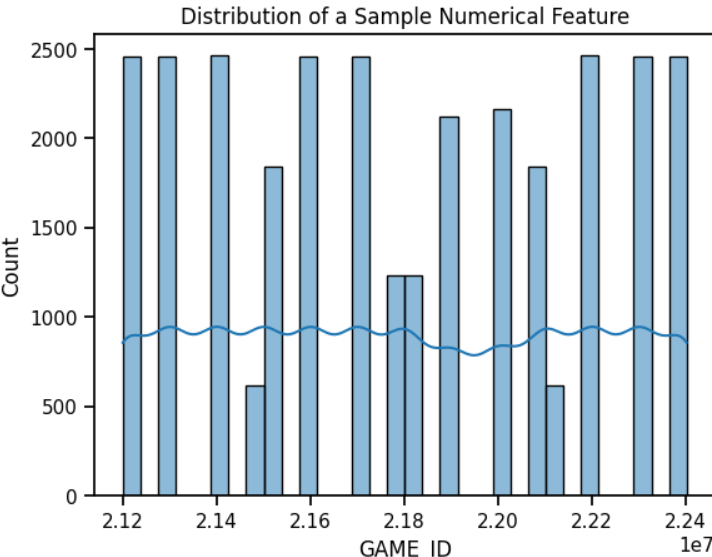
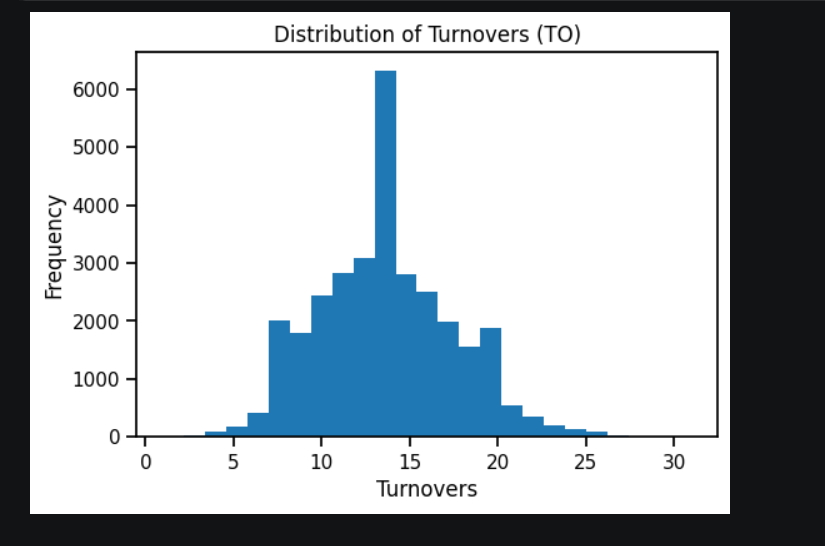
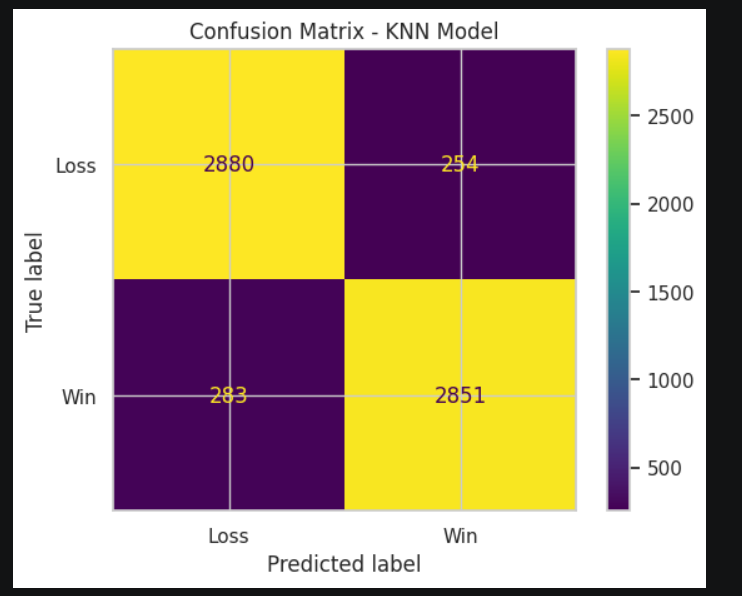

# NBA Player Performance Analysis 🏀

A data science project focused on analyzing NBA player statistics using Python and data visualization techniques.

## Features
- NBA player data analysis
- Statistical insights and trends
- Data visualization using graphs and charts
- Correlation analysis
- Machine learning/data analysis workflow

## Technologies Used
- Python
- Pandas
- NumPy
- Matplotlib
- Seaborn
- Jupyter Notebook

## Dataset
The project uses NBA player statistics dataset for performance analysis and visualization.

## Project Structure

```bash
├── data/
├── notebook/
├── screenshots/
└── README.md
```

## Future Improvements
- Add interactive dashboard
- Improve predictive analysis
- Add advanced ML models
- Deploy visualization dashboard

## Screenshots

### Correlation Heatmap


### Data Visualization


### Histogram


### Confusion Matrix


## Author
Fiza Qamar
